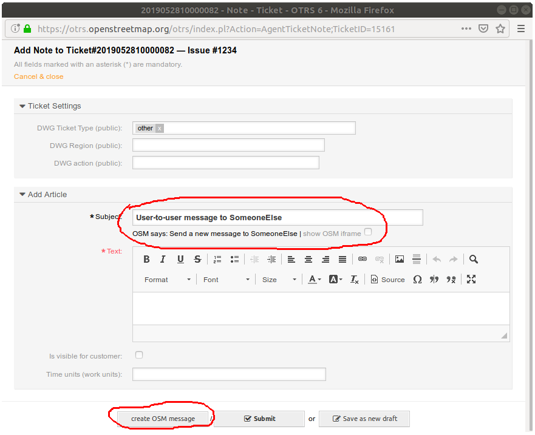

# osm-dwg-userscripts
User Scripts for DWG (OSM moderator) usage

The scripts have been developed for "Violentmonkey" on Firefox. "Greasemonkey" does not work with all scripts.

## dwg_issue2ticket.user.js

Intended for use on the OSM website "issues" page. Adds a "create OTRS ticket" link near the top of the page. Creates OTRS tickets using a configured OTRS web service.

The script stores OTRS user name and password in Greasemonkey's internal variable storage. 

To install:

Activate the "Violentmonkey" extension, then navigate to https://github.com/woodpeck/osm-dwg-userscripts/raw/master/dwg_issue2ticket.user.js

## dwg_issue2ticket.user.js

Intended for use on OTRS. When adding a "note" to a ticket, allows to create an OSM user-to-user message from the note text. The recipient user name is taken from the note subject line, which must end in "to <username>". The message body is taken from the note body, except if the first line of the note body is "Subject: XXX", in which case this is used as a subject line for the message.

The script requires the disabling of frame-related security features in the browser (because it relies on controlling an instance of the OSM web site loaded into an invisible IFrame, and the OSM web site uses headers to forbid that). See script header comment for details.

To install: 

Activate the "Violentmonkey" extension, then navigate to https://github.com/woodpeck/osm-dwg-userscripts/raw/master/dwg_usermessage.user.js
