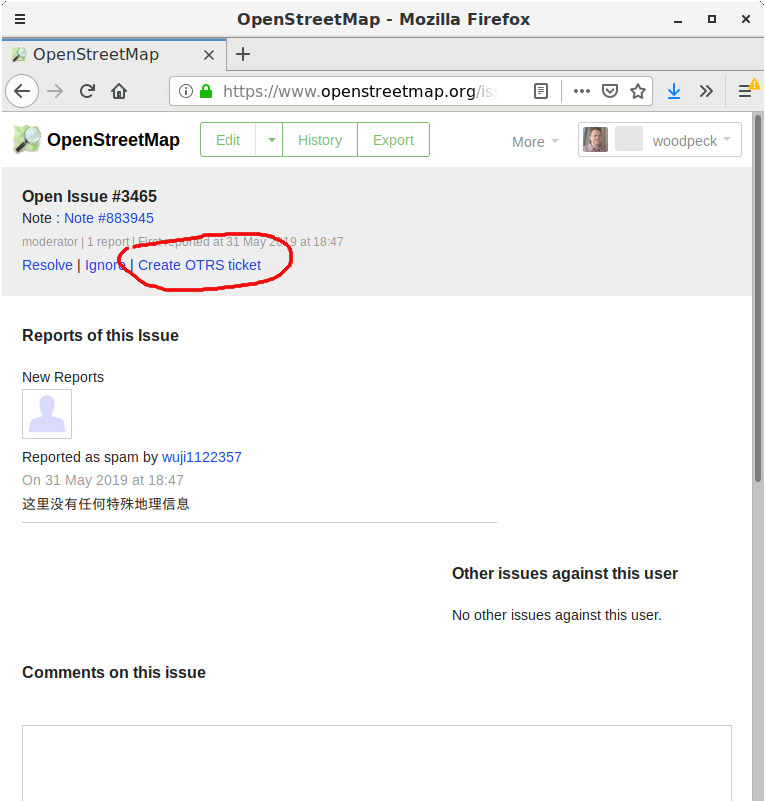

# osm-dwg-userscripts
GreaseMonkey User Scripts for DWG (OSM moderator) usage

### dwg_issue2ticket.user.js

Intended for use on OSM website "issues" page. Adds a "create OTRS ticket" link near the top of the page. Creates OTRS tickets using a configured OTRS web service.

The script stores OTRS user name and password in Greasemonkey's internal variable storage. 
